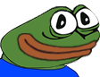

# Installation

1. Download Node.js
2. Do `npm i` in the console
3. (Optional) Download FFmpeg (if you dont wanna use the one that is there)
4. (Optional) Place FFmpeg where the `index.js` file is.
5. Add your bot token, peferred prefix and the client id of the bot in a file called config.json (Use the template and just rename it to config.json)
6. run `start_bot.bat`

